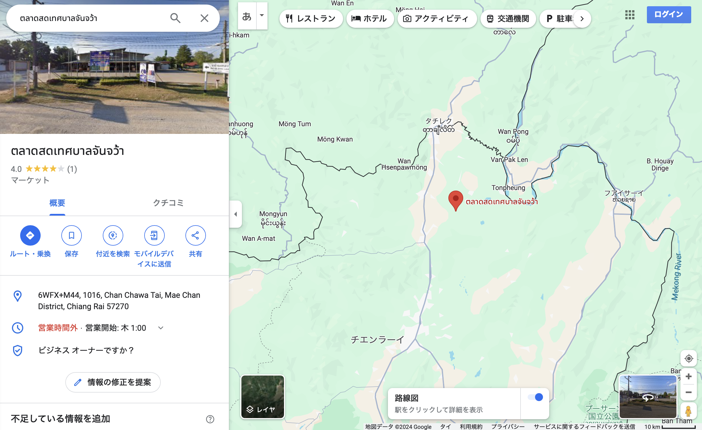
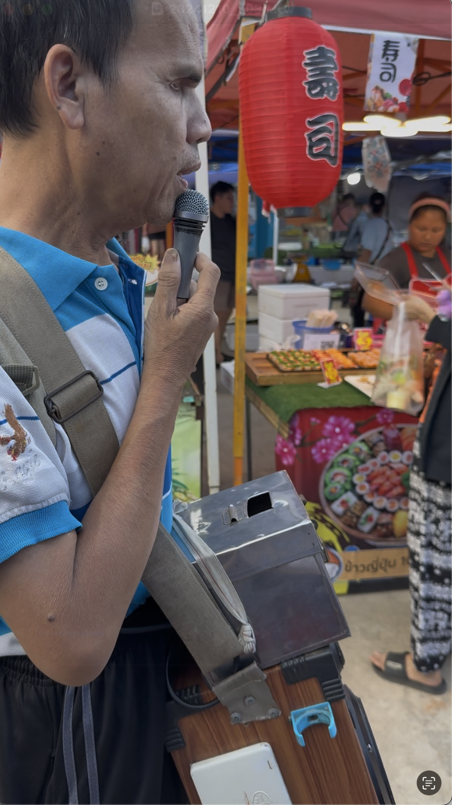

# 20241210_chiangrai

<html>
<head>

<meta charset="UTF-8">
<meta http-equiv="Content-Type" content="text/html; charset=UTF-8">
<meta http-equiv="X-UA-Compatible" content="IE=EmulateIE10" />
<meta http-equiv="X-UA-Compatible" content="IE=edge">

<!--ここから上はお決まりの定型文です-->

<!--ここからが表現の書式などを決めるcssという部分-->

<link href="https://cdnjs.cloudflare.com/ajax/libs/lightbox2/2.7.1/css/lightbox.css" rel="stylesheet">

</head>

<body>

モバイル端末をお使いの場合は、画面を横向きにすると
より見やすくご覧頂けます。

<!--ここ上は、ほぼそのまま使います！-->

<!--QRコードの挿入例-->

 アクセス用QRコード

<marquee direction="left" scrollamount="20" width="30%">(^_^)/~S,Hada</marquee>

<!--流れ文字の挿入例-->
<h1><marquee behavior="left">!!! 2024/12/10 、チェンライ郊外のメーチャンで火曜と土曜のみ開催される市場に行ってきました !!!</marquee></h1>

                          

<!--ここから下が、本体部分-->

<h2>場所はメーチャンから北東に移動した辺り 画像のクリックでGoogleMapsに飛びます</h2>

<h2>チャンチャワー町役場とHonda販売店の隣</h2>

<h2>鮮魚売り場</h2>
<iframe width="560" height="315" src="https://www.youtube.com/embed/RrGeN9kvZyw?si=p7j8buLTTYryiprG" title="YouTube video player" frameborder="0" allow="accelerometer; autoplay; clipboard-write; encrypted-media; gyroscope; picture-in-picture; web-share" referrerpolicy="strict-origin-when-cross-origin" allowfullscreen></iframe> 

<h2>扇風機を改造したハエを追い払う装置、昔日本でもやってましたね〜</h2>
<iframe width="560" height="315" src="https://www.youtube.com/embed/R5YwrbADrNg?si=tR_hgubv11IcM7Oy" title="YouTube video player" frameborder="0" allow="accelerometer; autoplay; clipboard-write; encrypted-media; gyroscope; picture-in-picture; web-share" referrerpolicy="strict-origin-when-cross-origin" allowfullscreen></iframe> 

<h2>食べ物以外にも金物屋さん、ちっちゃい女の子用の下着、子供用サンダルなど〜</h2>

<h2>ミスドもどきは、ほぼ完璧</h2>

<h2>市場の上にはお月様〜</h2>

<h2>日陰の位置がずれたので、傘の位置修正</h2>

<h2>合鍵屋さん</h2>

<h2>バッタモンもあります、「SENKO」などなど</h2>

<h2>障害者の盲人が歌で寄付を募ってました 結構お金集まったようです</h2>

  

<h2>
<a href="https://torokoid.github.io/20241126_chiangrai/" target="_blank">Back to the menu page</a>
</h2>

   

   

         

  

      

<!--本体はここまで-->

<!--画面に空白地帯を作って、背景が見えるようにしています-->
                                              

<!-- フッタ -->
<footer>

Copyright 2024/12/10 S,Hada @ChiangRai

</footer>

<!--HPにさまざまなJavaScriptを呼び込むための書式-->

